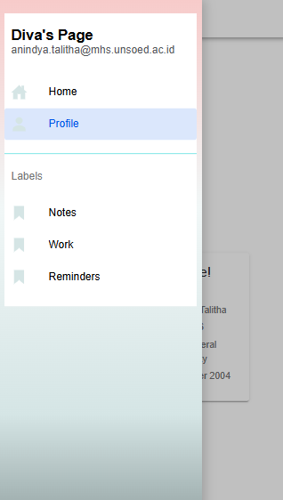
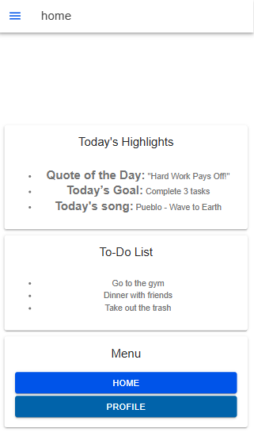
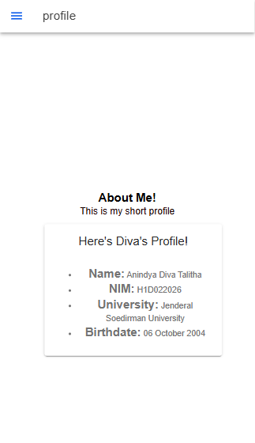

ANINDYA DIVA TALITHA
H1D022026

-- Sidebar --

-- Menu Home --

-- Menu Profile --

Bagaimana cara untuk menambahkan komponen di halaman ionic?
Pada program saya, sya menambahkan komponen card pada setiap menu. Pada 'ion-card'mempunyai struktur khusus yaitu 'ion-card-header', 'ion-card-title', dan 'ion-card-content'. Elemen 'ion-card-header' biasanya digunakan untuk menampilkan judul atau header kartu di mana kita dapat memasukkan elemen 'ion-card-title' sebagai judul utama dan 'ion-card-content' untuk menyimpan isi kartu seperti teks.
Salah satu contoh penggunaan card pada program yang saya buat yaitu pada menu profile. Di dalam 'ion-card' terdapat 'ion-card-header' yang memuat 'ion-card-title' dengan judul “Today's Highlights,” memberikan penanda atau judul utama untuk konten kartu. Bagian konten utama dari kartu berada dalam elemen 'ion-card-content' yang menampung sebuah list berbentuk '<ul>'. Daftar ini berisi tiga item ('<li>'), masing-masing menampilkan informasi untuk "Quote of the Day" dengan kutipan "Hard Work Pays Off!", "Today’s Goal" dengan tujuan harian “Complete 3 tasks,” dan "Today's Song" yang menampilkan lagu "Pueblo" dari "Wave to Earth". Setiap item dalam daftar menggunakan tag '<strong>' untuk menonjolkan label, sehingga memberikan tampilan yang lebih terstruktur dan informatif bagi pengguna.